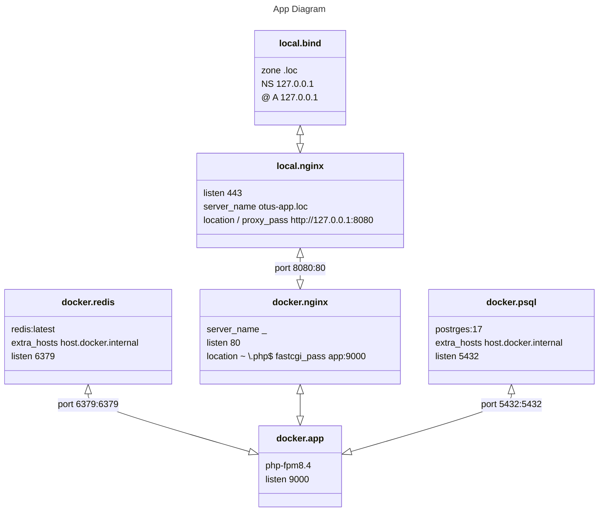

```mermaid
---
title: App Diagram
---
classDiagram
    local.bind <|--|> local.nginx
    local.nginx <|--|> docker.nginx : port 8080#58;80
    docker.redis <|--|> docker.app : port 6379#58;6379
    docker.nginx <|--|> docker.app
    docker.psql <|--|> docker.app : port 5432#58;5432
    local.bind : zone .loc
    local.bind : NS 127.0.0.1
    local.bind : @ A 127.0.0.1 
    local.nginx : listen 443
    local.nginx : server_name otus-app.loc
    local.nginx : location / proxy_pass http#58;//127.0.0.1#58;8080
    docker.nginx : server_name _
    docker.nginx : listen 80
    docker.nginx : location ~ #92;.php$ fastcgi_pass app#58;9000
    docker.app : php-fpm8.4
    docker.app : listen 9000
    docker.psql : postrges#58;17
    docker.psql : extra_hosts host.docker.internal
    docker.psql : listen 5432
    docker.redis : redis#58;latest
    docker.redis : extra_hosts host.docker.internal
    docker.redis : listen 6379
```